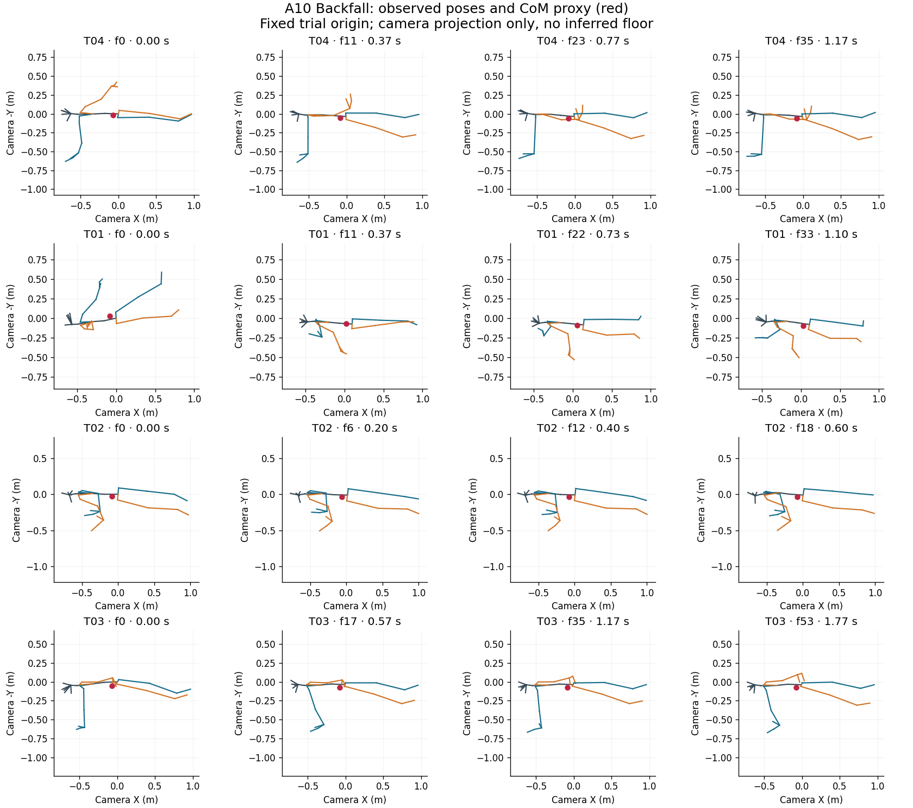
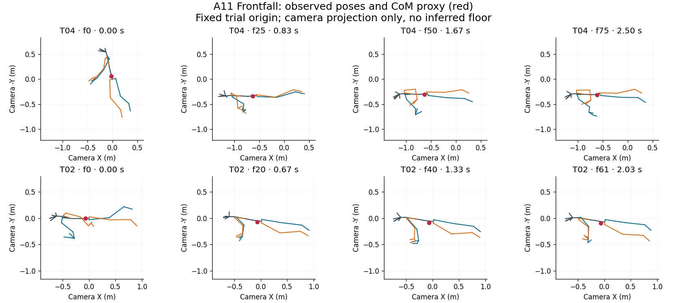
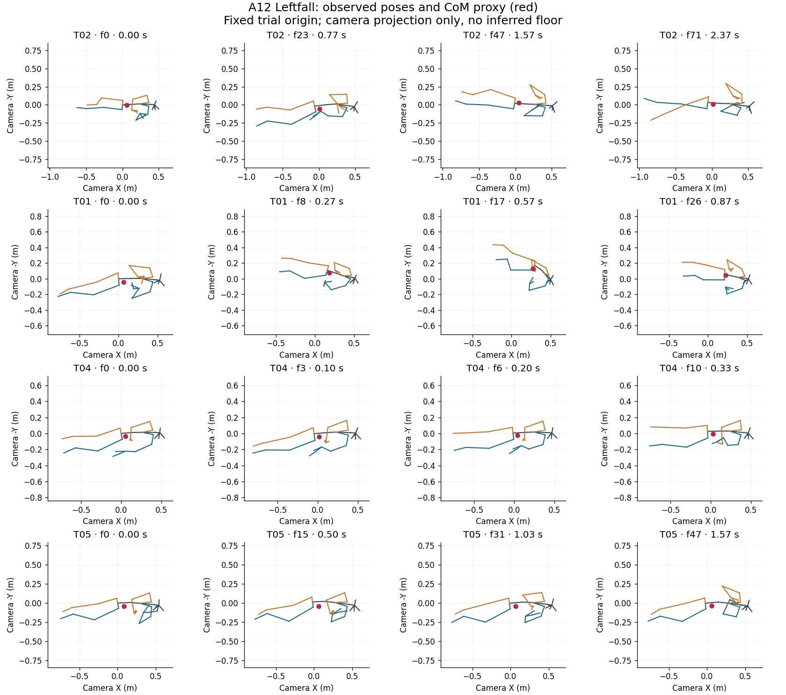
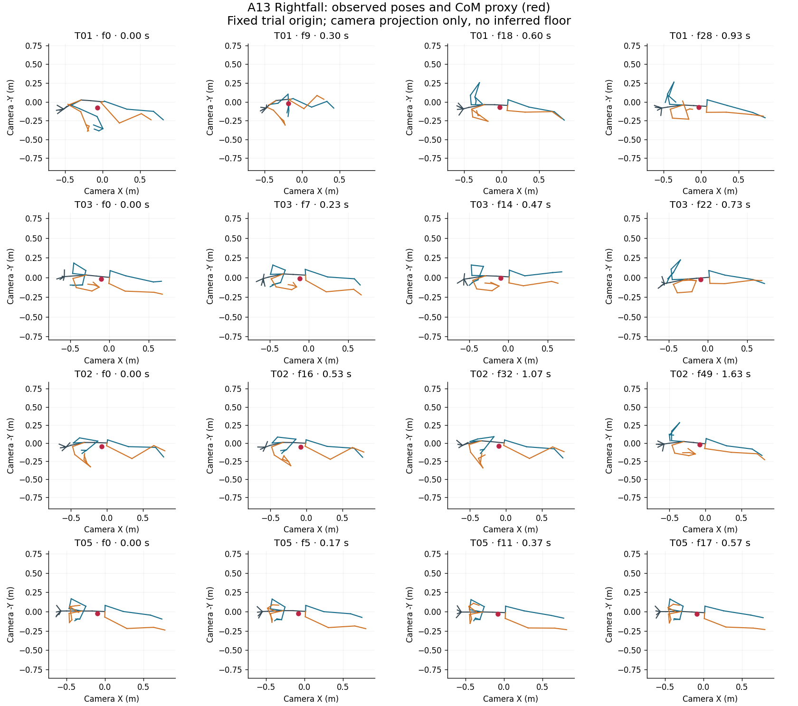
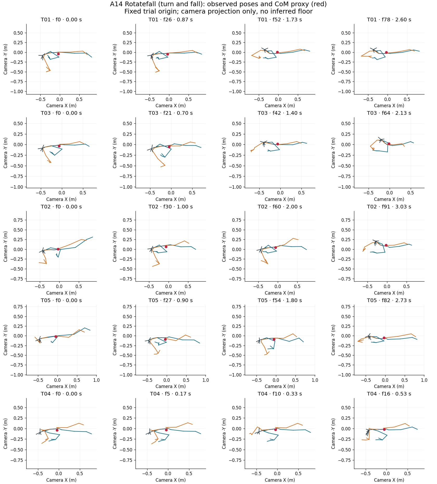
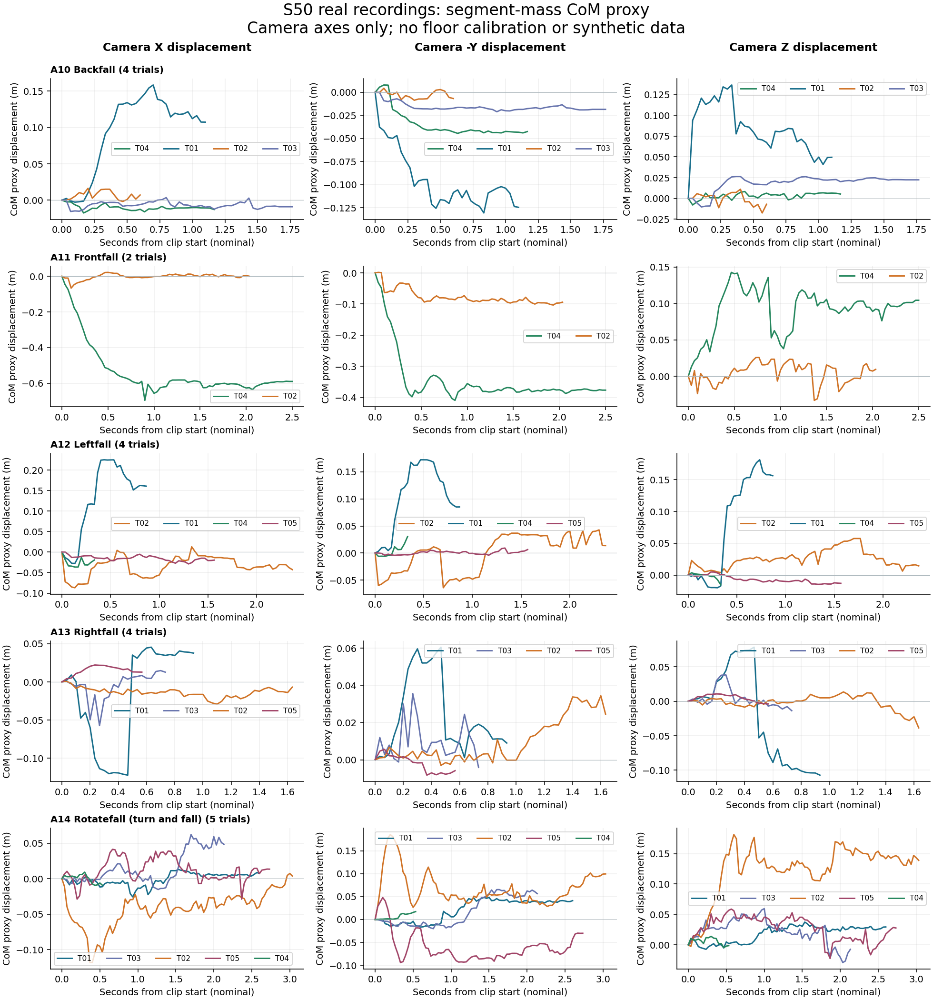
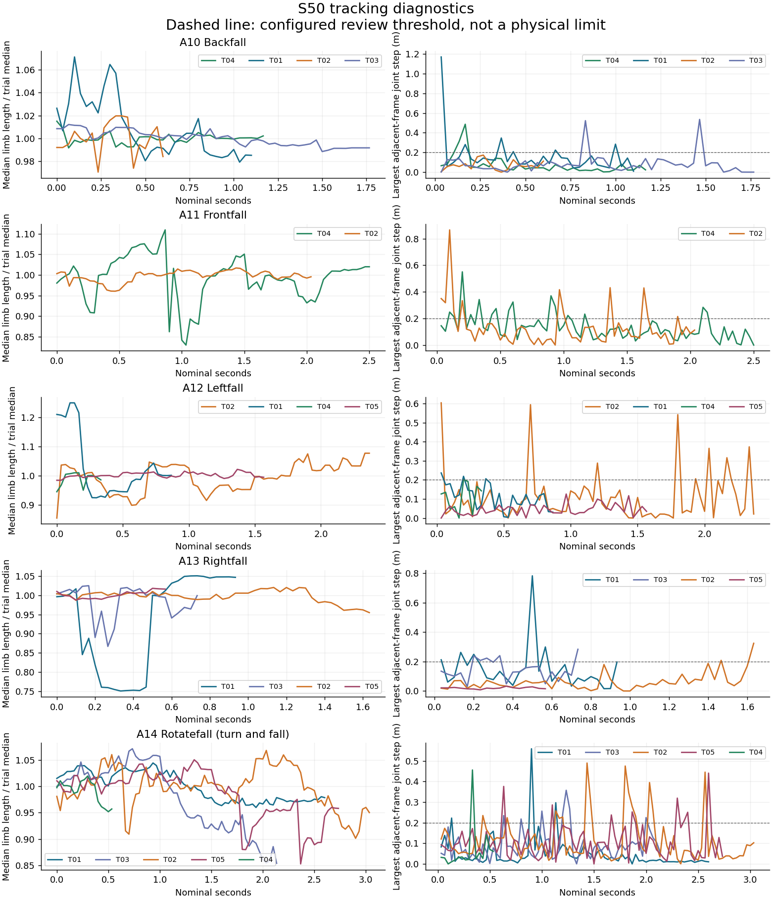

# S50 audit findings

Usable numeric clips: 19; empty: 6; missing expected: 0; invalid: 0; analyzed frames: 895.

Review-flagged destination frames: 136. Duplicate rows within clips: 6.

These are data-quality screening results, not validated fall labels or anatomical CoM. No frames are repaired or interpolated. Invalid trials remain in raw/ and manifest.json but are withheld from calculations.

| Trial | Status | Frames | Span (s) | Review frames |
|---|---|---:|---:|---:|
| S50A11T05 | empty | 0 | None | — |
| S50A11T04 | numeric | 76 | 2.5 | 23 |
| S50A13T01 | numeric | 29 | 0.9333333333333333 | 7 |
| S50A13T03 | numeric | 23 | 0.7333333333333333 | 7 |
| S50A13T02 | numeric | 50 | 1.6333333333333333 | 2 |
| S50A11T03 | empty | 0 | None | — |
| S50A11T02 | numeric | 62 | 2.033333333333333 | 10 |
| S50A13T05 | numeric | 18 | 0.5666666666666667 | 0 |
| S50A11T01 | empty | 0 | None | — |
| S50A13T04 | empty | 0 | None | — |
| S50A14T01 | numeric | 79 | 2.6 | 3 |
| S50A14T03 | numeric | 65 | 2.1333333333333333 | 11 |
| S50A14T02 | numeric | 92 | 3.033333333333333 | 22 |
| S50A14T05 | numeric | 83 | 2.7333333333333334 | 12 |
| S50A14T04 | numeric | 17 | 0.5333333333333333 | 2 |
| S50A12T02 | numeric | 72 | 2.3666666666666667 | 12 |
| S50A12T03 | empty | 0 | None | — |
| S50A10T04 | numeric | 36 | 1.1666666666666667 | 2 |
| S50A12T01 | numeric | 27 | 0.8666666666666667 | 8 |
| S50A10T05 | empty | 0 | None | — |
| S50A10T01 | numeric | 34 | 1.1 | 7 |
| S50A12T04 | numeric | 11 | 0.3333333333333333 | 3 |
| S50A12T05 | numeric | 48 | 1.5666666666666667 | 0 |
| S50A10T02 | numeric | 19 | 0.6 | 3 |
| S50A10T03 | numeric | 54 | 1.7666666666666666 | 2 |

## Evidence and reproducibility

- results/manifest.json: source paths, hashes and parsing errors.
- results/trial_summary.csv: clip-level measurements.
- results/review_events.csv (when flags exist): exact frame pairs for inspection.
- results/com/: per-frame CoM and camera displacements.
- results/segment_mass_model.csv and segment_model.json: full mass and landmark mapping.
- results/landmark_sensitivity.csv: alternative mappings, not uncertainty bounds.
- config.json and code/: frozen configuration and scripts.

## Questions for the team

Confirm XYZ units/order, camera-to-floor orientation, original timestamps, missing/trimmed recordings and body-tracking confidence. Determine whether changing limb scale is in the raw export or preprocessing. Review full event coverage before selecting PINN trials. No ground contact, BoS, joint forces or external perturbations are inferred here.

## Evidence figures

